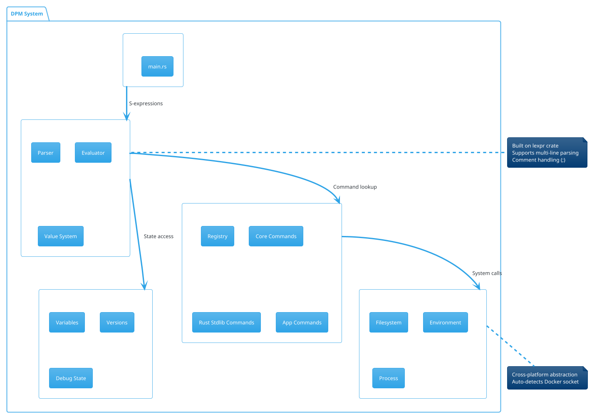
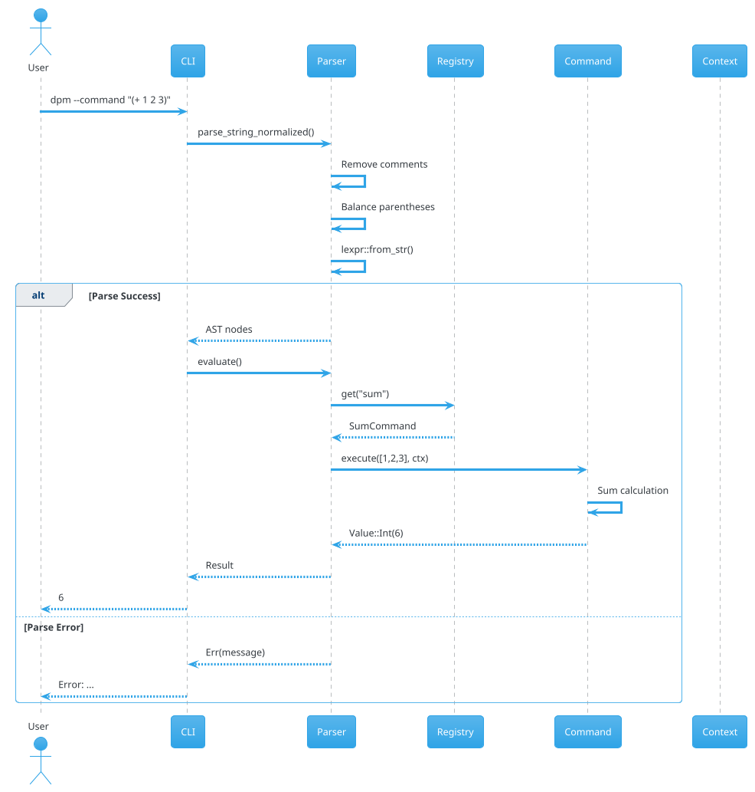
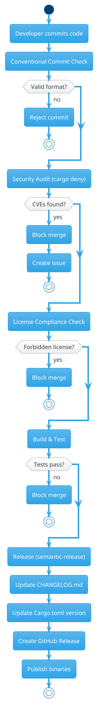

# DPM Antora Documentation Structure Proposal

## Executive Summary

Docker Project Manager (DPM) is a **Lisp-based command interpreter** for managing Docker environments. This proposal outlines an Antora documentation structure that emphasizes:

- **Marketing clarity**: Clear value proposition for DevOps teams
- **Security transparency**: Full visibility into security practices
- **Accuracy**: Version-synced docs that match the actual implementation
- **Consumer focus**: Practical guides for real-world Docker workflows

---

## 1. Codebase Audit Summary

### Architecture Overview

```
dpm/
├── src/
│   ├── main.rs                    # CLI entry point (--pipe, --command, --file)
│   ├── lisp_interpreter.rs        # Core: S-expression parser, Value types, CommandRegistry
│   ├── context.rs                 # Execution context with variables, versions, debug
│   ├── core.rs                    # Config, constants, Command trait
│   ├── docker.rs                  # Docker integration (deprecated → commands/app/docker)
│   ├── commands/
│   │   ├── core/                  # Basic operations
│   │   │   ├── print.rs           # (print ...)
│   │   │   ├── sum.rs             # (+ ...)  
│   │   │   ├── pipe.rs            # (pipe ...)
│   │   │   ├── multiply.rs        # (* ...)
│   │   │   ├── concat.rs          # (concat ...)
│   │   │   ├── debug.rs           # (debug ...)
│   │   │   ├── vars.rs            # Variable operations
│   │   │   ├── files.rs           # File listing
│   │   │   ├── help.rs            # Help system
│   │   │   ├── basedir.rs         # Base directory management
│   │   │   ├── read_env.rs        # Environment reading
│   │   │   └── list_utils.rs      # List operations
│   │   ├── rust/                  # Rust stdlib wrappers
│   │   │   ├── env.rs             # (rust-env-*)
│   │   │   ├── path.rs            # (rust-path-*)
│   │   │   ├── fs.rs              # (rust-fs-*)
│   │   │   └── process.rs         # (rust-process-*)
│   │   └── app/                   # Application-specific
│   │       ├── docker.rs          # Docker commands
│   │       ├── write_env.rs       # Environment writing
│   │       └── version_check.rs   # Version validation
│   ├── file_ops.rs                # File operations
│   ├── env_ops.rs                 # Environment operations
│   ├── utils.rs                   # Utilities
│   ├── emoji.rs                   # Emoji support
│   └── model.rs                   # Data models
├── Cargo.toml                     # v1.6.2, Rust 1.88.0+
├── deny.toml                      # cargo-deny config
├── .releaserc.json                # semantic-release config
└── .github/workflows/             # CI/CD
    ├── build-multiarch.yml
    ├── commit-validation.yml
    ├── release.yml
    └── security-audit.yml
```

### Key Technical Facts

| Aspect | Detail |
|--------|--------|
| **Language** | Rust 2021 Edition, MSRV 1.88.0 |
| **Version** | 1.6.2 (auto-versioned via semantic-release) |
| **License** | GPL-3.0 |
| **Entry Points** | `--pipe`, `--command`, `--file` |
| **Command System** | Trait-based + closure-based registration |
| **Parsing** | `lexpr` crate for S-expressions |
| **Dependencies** | walkdir, md-5, regex, dirs, emojis-rs, uzers (unix) |

### Command Categories (35+ commands)

| Category | Prefix | Count | Examples |
|----------|--------|-------|----------|
| **Core** | (print), (+), (*), (pipe) | ~12 | Arithmetic, printing, piping |
| **Environment** | (rust-env-*) | 4 | current-dir, var, vars, home-dir |
| **Filesystem** | (rust-fs-*) | 6 | read-to-string, write, create-dir, copy |
| **Path** | (rust-path-*) | 8 | join, parent, filename, extension, exists |
| **Process** | (rust-process-*) | 2 | command, output |
| **Application** | (docker), (write-env) | 3 | Docker execution, env management |

---

## 2. Antora Component Structure

### Recommended Component Layout

```
antora/
└── dpm/
    ├── antora.yml                  # Component descriptor
    ├── modules/
    │   ├── ROOT/                   # Landing page & global nav
    │   │   ├── nav.adoc
    │   │   └── pages/
    │   │       └── index.adoc
    │   ├── intro/                  # Introduction & value proposition
    │   │   ├── nav.adoc
    │   │   └── pages/
    │   │       ├── why-dpm.adoc
    │   │       ├── use-cases.adoc
    │   │       └── comparison.adoc
    │   ├── getting-started/        # Quick start guides
    │   │   ├── nav.adoc
    │   │   ├── pages/
    │   │   │   ├── installation.adoc
    │   │   │   ├── first-command.adoc
    │   │   │   └── configuration.adoc
    │   │   └── examples/
    │   │       └── _example.adoc
    │   ├── commands/               # Command reference (auto-generated potential)
    │   │   ├── nav.adoc
    │   │   └── pages/
    │   │       ├── overview.adoc
    │   │       ├── core-commands.adoc
    │   │       ├── environment-commands.adoc
    │   │       ├── filesystem-commands.adoc
    │   │       ├── path-commands.adoc
    │   │       ├── process-commands.adoc
    │   │       └── docker-commands.adoc
    │   ├── architecture/           # Technical deep-dive
    │   │   ├── nav.adoc
    │   │   └── pages/
    │   │       ├── lisp-interpreter.adoc
    │   │       ├── command-system.adoc
    │   │       ├── context-variables.adoc
    │   │       └── extending-commands.adoc
    │   ├── security/               # Security documentation
    │   │   ├── nav.adoc
    │   │   └── pages/
    │   │       ├── security-overview.adoc
    │   │       ├── supply-chain.adoc
    │   │       ├── best-practices.adoc
    │   │       └── vulnerability-reporting.adoc
    │   ├── deployment/             # Build & deployment
    │   │   ├── nav.adoc
    │   │   └── pages/
    │   │       ├── building.adoc
    │   │       ├── cross-platform.adoc
    │   │       └── ci-cd.adoc
    │   └── development/            # Contributor guide
    │       ├── nav.adoc
    │       └── pages/
    │           ├── contributing.adoc
    │           ├── code-style.adoc
    │           ├── testing.adoc
    │           └── release-process.adoc
    └── images/
        ├── diagrams/
        │   ├── architecture-overview.puml
        │   ├── command-execution-flow.puml
        │   ├── lisp-evaluation-sequence.puml
        │   └── docker-integration.puml
        └── screenshots/
```

### antora.yml Configuration

```yaml
name: dpm
title: Docker Project Manager
version: '1.6.2'  # Synced from Cargo.toml via CI
start_page: ROOT:index.adoc

nav:
  - modules/ROOT/nav.adoc
  - modules/intro/nav.adoc
  - modules/getting-started/nav.adoc
  - modules/commands/nav.adoc
  - modules/architecture/nav.adoc
  - modules/security/nav.adoc
  - modules/deployment/nav.adoc
  - modules/development/nav.adoc

ext:
  collector:
    run:
      - command: node scripts/generate-command-docs.js
        env: {}
```

---

## 3. Module Details & Key Pages

### Module 1: ROOT (Landing Page)

**Purpose**: First impression, value proposition, navigation hub

```asciidoc
= Docker Project Manager (DPM)
:navtitle: Home
:toc: macro
:toclevels: 2

ifdef::env-github[]
image:https://img.shields.io/badge/Built%20with-Rust-orange?logo=rust&logoColor=white[Rust]
image:https://img.shields.io/badge/Compatible%20with-Docker-blue?logo=docker&logoColor=white[Docker]
image:https://img.shields.io/badge/License-GPL--3.0-green[License]
endif::[]

== The Lisp-Powered Docker Orchestrator

DPM brings the power of **functional programming** to Docker environment management through an intuitive S-expression interface.

[cols="1,2", frame=none, grid=cols]
|===
| *🚀 Cross-Platform* | Linux, macOS (Intel/ARM), Windows — one tool, everywhere

| *🔒 Security-First* | cargo-deny audits, supply chain transparency, sensitive data masking

| *⚡ Scriptable* | Pipe, embed, compose — DPM fits your workflow

| *🧩 Extensible* | Add custom commands via Rust traits or closures
|===

toc::[]

== Quick Start

[source,bash]
----
# Pipe mode
echo "(print \"Hello Docker\")" | dpm --pipe

# Command mode
dpm --command "(rust-env-current-dir)"

# File mode
dpm --file my-script.lisp
----

== Why Teams Choose DPM

[cols="1,1,1", frame=none, grid=cols]
|===
| image:images/icons/efficiency.svg[Efficiency,48,48] | image:images/icons/security.svg[Security,48,48] | image:images/icons/flexibility.svg[Flexibility,48,48]

| *Reduce Complexity* | *Audit-Ready* | *Adapt to Any Stack*
| Single interface for Docker env management | Full dependency audit trail | Works with any Docker Compose setup
|===
```

### Module 2: Introduction (Marketing Focus)

**Purpose**: Convince readers why DPM solves their problems

#### Page: `why-dpm.adoc`

```asciidoc
= Why DPM?
:navtitle: Why DPM?

== The Problem

Managing Docker environments across projects involves:

* Repetitive environment variable juggling
* Platform-specific path handling
* Version tracking chaos
* Security-sensitive configuration scattered everywhere

== The DPM Solution

=== Unified Command Interface

Instead of shell scripts, batch files, and Makefiles:

[source,bash]
----
# Traditional approach (fragile, platform-specific)
export HOST_UID=$(id -u)
export HOST_GID=$(id -g)
export PROJECT_NAME=$(basename $(pwd))
docker compose run --rm -T app
----

With DPM:

[source,lisp]
----
(rust-env-set "HOST_UID" (rust-process-output "id" "-u"))
(rust-env-set "HOST_GID" (rust-process-output "id" "-g"))
(rust-env-set "PROJECT_NAME" (rust-path-filename (rust-env-current-dir)))
----

=== Cross-Platform by Design

[cols="1,2", frame=none]
|===
| *Challenge* | *DPM Solution*

| Path separators (`\` vs `/`) | `(rust-path-join "a" "b")` → handles automatically
| Line endings (CRLF vs LF) | File ops normalize transparently
| Docker socket locations | Auto-detects standard, Desktop, XDG paths
|===

=== Security Without Friction

* **Sensitive data masking**: Debug output automatically hides passwords, tokens, API keys
* **Dependency auditing**: `cargo-deny` enforces license compliance and vulnerability checks
* **Supply chain transparency**: Full SBOM via GitHub's dependency graph
```

### Module 3: Commands Reference

**Purpose**: Comprehensive command documentation (potential for auto-generation)

#### Page: `overview.adoc`

```asciidoc
= Command Reference
:navtitle: Commands

== Syntax

DPM uses S-expression syntax: `(command arg1 arg2 ...)`

== Command Categories

[cols="1,1,3", frame=none]
|===
| *Category* | *Prefix* | *Purpose*

| Core | `(print)`, `(+)`, `(*)` | Basic operations, arithmetic, I/O
| Environment | `(rust-env-*)` | System environment variables
| Filesystem | `(rust-fs-*)` | File and directory operations
| Path | `(rust-path-*)` | Cross-platform path manipulation
| Process | `(rust-process-*)` | Execute system commands
| Docker | `(docker)` | Docker Compose integration
|===

== Getting Help

[source,lisp]
----
;; List all commands
(help)

;; Get help for specific command
(help "rust-fs-read-to-string")
----

== Command Index

NOTE: This section can be auto-generated from command metadata

[cols="1,2,3,2", options="header"]
|===
| Command | Syntax | Description | Example

| `print` | `(print ...)` | Concatenate and print values | `(print "Hello" "World")`
| `+` | `(+ n1 n2 ...)` | Sum integers | `(+ 1 2 3)` → `6`
| `rust-env-var` | `(rust-env-var "NAME")` | Get env variable | `(rust-env-var "PATH")`
| `rust-fs-read-to-string` | `(rust-fs-read-to-string "path")` | Read file | `(rust-fs-read-to-string "config.json")`
|===
```

#### Page: `core-commands.adoc` (Template for all command pages)

```asciidoc
= Core Commands
:navtitle: Core Commands

== print

Concatenates arguments and returns as string.

[source,lisp]
----
(print "Hello" " " "World")
;; => "Hello World"
----

[cols="1,3", frame=none]
|===
| *Parameter* | *Description*

| `...` | Values to concatenate (strings, numbers auto-converted)
|===

== pipe

Passes input through a pipeline of commands.

[source,lisp]
----
(pipe
  (+ 1 2 3)
  (print "Sum is: " _))
;; => "Sum is: 6"
----

TIP: Use `_` as placeholder for the piped value.

== Arithmetic Operations

=== + (sum)

Adds all numeric arguments.

[source,lisp]
----
(+ 10 20 30)    ;; => 60
(+ 1 2 (+ 3 4)) ;; => 10 (nested)
----

=== * (multiply)

Multiplies all numeric arguments.

[source,lisp]
----
(* 2 3 4)       ;; => 24
----
```

### Module 4: Architecture (Technical Deep-Dive)

#### Page: `lisp-interpreter.adoc`

```asciidoc
= Lisp Interpreter
:navtitle: Lisp Interpreter

== Overview

DPM's core is a custom Lisp interpreter built on the `lexpr` crate.

[plantuml, architecture-overview, svg]
----
@startuml
!theme cerulean

package "CLI Layer" {
  [main.rs]
  [Argument Parser]
}

package "Lisp Interpreter" {
  [Parser]
  [AST Evaluator]
  [Value System]
}

package "Command System" {
  [CommandRegistry]
  [Command Trait]
  [Closure Commands]
}

package "Context" {
  [Variables]
  [Versions]
  [Debug State]
}

[main.rs] --> [Argument Parser]
[Argument Parser] --> [Parser]
[Parser] --> [AST Evaluator]
[AST Evaluator] --> [CommandRegistry]
[AST Evaluator] --> [Value System]
[CommandRegistry] --> [Command Trait]
[AST Evaluator] --> [Context]

@enduml
----

== Value System

The `Value` enum represents all data types in DPM:

[source,rust]
----
pub enum Value {
    Int(i64),      // Integer numbers
    Str(String),   // Strings
    Bool(bool),    // Booleans
    List(Vec<Value>), // Lists/arrays
    Nil,           // Null/void
}
----

== Command Registration

=== Struct-Based Commands

[source,rust]
----
pub struct MyCommand;

impl Command for MyCommand {
    fn execute(&self, args: Vec<Value>, ctx: &mut Context) -> Result<Value, String> {
        // Implementation
        Ok(Value::Str("result".to_string()))
    }
    
    fn name(&self) -> &'static str { "my-command" }
    fn description(&self) -> &'static str { "Does something useful" }
}
----

=== Closure-Based Commands

[source,rust]
----
registry.register_closure_with_help(
    "my-cmd",
    "Short description",
    "(my-cmd arg1 arg2)",
    "(my-cmd \"hello\" 42)",
    |args, ctx| {
        // Implementation
        Ok(Value::Nil)
    }
);
----
```

### Module 5: Security

#### Page: `security-overview.adoc`

```asciidoc
= Security Overview
:navtitle: Security

== Security Model

DPM is designed with security-first principles for DevOps workflows.

[plantuml, security-layers, svg]
----
@startuml
!theme cerulean

skinparam package {
  BackgroundColor<<layer>> #E8F5E9
}

package "Supply Chain Security" <<layer>> {
  [cargo-deny]
  [GitHub Dependency Graph]
  [Renovate Bot]
}

package "Runtime Security" <<layer>> {
  [Sensitive Data Masking]
  [Environment Isolation]
  [Socket Permission Checks]
}

package "Build Security" <<layer>> {
  [GitHub Actions]
  [Reproducible Builds]
  [Binary Signing]
}

[cargo-deny] --> [Runtime Security]
[GitHub Actions] --> [Build Security]

@enduml
----

== Dependency Auditing

DPM uses `cargo-deny` to enforce:

[cols="1,2", frame=none]
|===
| *Check* | *What It Validates*

| `advisories` | Known CVEs in dependencies
| `licenses` | Only approved licenses (GPL-3.0, MIT, Apache-2.0, etc.)
| `bans` | Duplicate version warnings
| `sources` | Only trusted registries (crates.io)
|===

Run locally:

[source,bash]
----
cargo deny check
----

== Sensitive Data Protection

DPM automatically masks sensitive data in debug output:

[source,lisp]
----
;; These variables are automatically masked:
;; - password, passwd, pwd
;; - token, secret
;; - api_key, apikey, access_key
;; - private_key, ssh_key
;; - auth, authorization, bearer, jwt, session

(debug)  ;; Shows: password = ******
----

== Vulnerability Reporting

See <<vulnerability-reporting.adoc>> for responsible disclosure process.
```

#### Page: `supply-chain.adoc`

```asciidoc
= Supply Chain Security
:navtitle: Supply Chain

== Dependency Transparency

=== SBOM Generation

DPM generates Software Bill of Materials via GitHub's dependency graph.

=== Dependency Lock File

`Cargo.lock` is committed to ensure reproducible builds.

== Allowed Licenses

[source,toml]
----
# deny.toml excerpt
allow = [
    "Apache-2.0",
    "MIT",
    "BSD-2-Clause",
    "BSD-3-Clause",
    "GPL-3.0",  # DPM's license
    # ... others
]
----

== CI/CD Security

[plantuml, ci-security-pipeline, svg]
----
@startuml
!theme cerulean

start
:Commit Push;
:Commit Validation;
if (Conventional Commit?) then (no)
  :Reject;
  stop
endif
:Security Audit;
if (CVEs Found?) then (yes)
  :Block Merge;
  stop
endif
:License Check;
if (Forbidden License?) then (yes)
  :Block Merge;
  stop
endif
:Build & Test;
if (Tests Pass?) then (no)
  :Block Merge;
  stop
endif
:Release;
stop

@enduml
----
```

### Module 6: Development Guide

#### Page: `extending-commands.adoc`

```asciidoc
= Extending DPM with Custom Commands
:navtitle: Extending Commands

== Adding New Commands

DPM's extensible architecture allows adding custom commands.

== Quick: Closure-Based

For simple commands, use closures:

[source,rust]
----
// In your command registration module
registry.register_closure_with_help(
    "my-custom-cmd",           // Command name
    "Does something useful",   // Description
    "(my-custom-cmd arg1)",    // Syntax
    "(my-custom-cmd \"test\")", // Example
    |args: Vec<Value>, ctx: &mut Context| -> Result<Value, String> {
        let arg = args.first()
            .ok_or("Missing argument")?;
        
        // Your logic here
        Ok(Value::Str(format!("Processed: {}", arg)))
    }
);
----

== Struct-Based (For Complex Commands)

[source,rust]
----
pub struct MyComplexCommand;

impl Command for MyComplexCommand {
    fn execute(
        &self, 
        args: Vec<Value>, 
        ctx: &mut Context
    ) -> Result<Value, String> {
        // Full implementation with error handling
        validate_args(&args)?;
        process(args, ctx)
    }
    
    fn name(&self) -> &'static str { "my-complex-cmd" }
    fn description(&self) -> &'static str { 
        "A complex command with validation" 
    }
    fn syntax(&self) -> &'static str { 
        "(my-complex-cmd <required> [optional])" 
    }
    fn examples(&self) -> &'static str { 
        "(my-complex-cmd \"value\")" 
    }
    fn tag(&self) -> &Tag { &tags::CORE }
}

// Register in mod.rs
registry.register(MyComplexCommand);
----

== Testing Commands

[source,rust]
----
#[cfg(test)]
mod tests {
    use super::*;
    use crate::lisp_interpreter::*;
    
    #[test]
    fn test_my_command() {
        let mut registry = CommandRegistry::new();
        registry.register(MyComplexCommand);
        let mut ctx = Context::new(registry);
        
        let result = evaluate_string(
            "(my-complex-cmd \"test\")", 
            &mut ctx
        ).unwrap();
        
        assert_eq!(result, Value::Str("Processed: test".to_string()));
    }
}
----
```

---

## 4. PlantUML Diagrams

### 4.1 Architecture Overview



### 4.2 Command Execution Flow



### 4.3 Docker Integration Flow

```plantuml
@startuml docker-integration
!theme cerulean

package "DPM Docker Integration" {
  [Socket Detection]
  [Environment Setup]
  [Docker Compose Command]
}

database "Docker Daemon" as daemon {
  [Standard Socket]
  [Desktop Socket]
  [XDG Socket]
}

participant "User Script" as script
participant "DPM" as dpm

script -> dpm : (docker "up" "-d")
dpm -> dpm : Detect socket location
alt Standard Path
  dpm -> daemon : /var/run/docker.sock
else Docker Desktop
  dpm -> daemon : ~/.docker/desktop/docker.sock
else XDG Runtime
  dpm -> daemon : $XDG_RUNTIME_DIR/docker.sock
end

dpm -> dpm : Set environment variables
dpm -> daemon : docker compose run --rm -T

note right of dpm
  Socket auto-detection handles:
  - Linux standard
  - macOS Docker Desktop
  - Linux with XDG_RUNTIME_DIR
  - Custom via DOCKER_HOST_MAP
end note

@enduml
```

### 4.4 Security Audit Flow



---

## 5. Marketing Content Strategy

### 5.1 Value Proposition Matrix

| Target Audience | Pain Point | DPM Solution | Message |
|-----------------|------------|--------------|---------|
| **DevOps Engineers** | Shell script hell | Unified Lisp interface | "One tool to rule all Docker configs" |
| **Cross-Platform Teams** | Platform-specific scripts | Automatic path/socket handling | "Write once, run everywhere" |
| **Security-Conscious Orgs** | Dependency uncertainty | cargo-deny + SBOM | "Auditable supply chain" |
| **Rust Enthusiasts** | Extensibility | Trait-based command system | "Extend with idiomatic Rust" |

### 5.2 Landing Page Sections

```asciidoc
== For Teams Drowning in Docker Scripts

=== Before DPM
[source,bash]
----
# Linux
export HOST_UID=$(id -u)
export HOST_GID=$(id -g)
docker compose -f docker-compose.yml -f docker-compose.dev.yml run --rm app

# macOS (different!)
export HOST_UID=1000
export HOST_GID=1000
docker compose run --rm app

# Windows (yet another approach)
docker compose run --rm app
----

=== After DPM
[source,lisp]
----
;; One script, all platforms
(rust-env-set "HOST_UID" (rust-process-output "id" "-u"))
(rust-env-set "HOST_GID" (rust-process-output "id" "-g"))
(docker "compose" "run" "--rm" "app")
----

*Same result. No platform-specific branches.*
```

### 5.3 Comparison Table

```asciidoc
[cols="1,1,1,1", options="header"]
|===
| Feature | Makefile | Shell Scripts | DPM

| Cross-platform | ❌ Manual | ❌ Manual | ✅ Automatic
| Type safety | ❌ None | ❌ None | ✅ Rust + Value system
| Dependency audit | ❌ Manual | ❌ Manual | ✅ cargo-deny
| Extensibility | Limited | Complex | ✅ Simple traits
| Testability | Hard | Hard | ✅ Unit tests
|===
```

---

## 6. Accuracy Maintenance Strategy

### 6.1 Version Synchronization

```yaml
# .github/workflows/sync-docs-version.yml
name: Sync Documentation Version

on:
  release:
    types: [published]

jobs:
  sync-version:
    runs-on: ubuntu-latest
    steps:
      - uses: actions/checkout@v4
      
      - name: Extract version from Cargo.toml
        id: version
        run: |
          VERSION=$(grep '^version' Cargo.toml | head -1 | sed 's/.*"\(.*\)".*/\1/')
          echo "version=$VERSION" >> $GITHUB_OUTPUT
      
      - name: Update antora.yml version
        run: |
          sed -i "s/^version: .*/version: '${{ steps.version.outputs.version }}'/" antora.yml
      
      - name: Commit docs version bump
        run: |
          git config user.name "github-actions"
          git config user.email "actions@github.com"
          git add antora.yml
          git commit -m "docs: sync version to ${{ steps.version.outputs.version }}"
          git push
```

### 6.2 Command Documentation Auto-Generation

Create a script that extracts command metadata:

```javascript
// scripts/generate-command-docs.js
const fs = require('fs');
const path = require('path');

// Parse Rust source files to extract command registrations
// Generate AsciiDoc tables for each command category

function extractCommands(sourceDir) {
  // Implementation to parse:
  // - register_closure_with_help() calls
  // - Command trait implementations
  // Returns structured command data
}

function generateCommandPage(category, commands) {
  // Generate AsciiDoc content with:
  // - Command name
  // - Syntax
  // - Description
  // - Examples
  // - Parameter table
}

// Generate all command pages
const commands = extractCommands('./src');
Object.entries(commands).forEach(([category, cmds]) => {
  const content = generateCommandPage(category, cmds);
  fs.writeFileSync(`modules/commands/pages/${category}-commands.adoc`, content);
});
```

### 6.3 Example Validation

```yaml
# .github/workflows/validate-examples.yml
name: Validate Documentation Examples

on:
  pull_request:
    paths:
      - 'docs/**'

jobs:
  validate-examples:
    runs-on: ubuntu-latest
    steps:
      - uses: actions/checkout@v4
      
      - name: Build DPM
        run: cargo build --release
      
      - name: Extract and run examples
        run: |
          # Extract code blocks from .adoc files
          # Run each with dpm --command
          # Report failures
```

---

## 7. Implementation Roadmap

### Phase 1: Foundation (Week 1-2)

- [ ] Set up Antora project structure
- [ ] Create `antora.yml` with version sync
- [ ] Write ROOT module (landing page)
- [ ] Write Introduction module (value proposition)
- [ ] Create basic command reference

### Phase 2: Core Documentation (Week 3-4)

- [ ] Complete command reference (all categories)
- [ ] Write Architecture module
- [ ] Create PlantUML diagrams
- [ ] Set up CI for docs build

### Phase 3: Security & Advanced (Week 5-6)

- [ ] Write Security module
- [ ] Write Development guide
- [ ] Implement auto-generation scripts
- [ ] Add example validation

### Phase 4: Polish & Launch (Week 7-8)

- [ ] Review all content for accuracy
- [ ] Add screenshots/GIFs
- [ ] Set up Antora hosting (Netlify/GitHub Pages)
- [ ] Announce documentation

---

## 8. File Templates

### 8.1 Module Navigation Template

```asciidoc
= Module Title
:navtitle: Module Title

* xref:index.adoc[Overview]
* xref:page1.adoc[Page 1 Title]
* xref:page2.adoc[Page 2 Title]
* xref:page3.adoc[Page 3 Title]
```

### 8.2 Command Page Template

```asciidoc
= Command Name
:navtitle: command-name

== Syntax

[source,lisp]
----
(command-name required-arg [optional-arg])
----

== Description

Detailed description of what the command does.

== Parameters

[cols="1,1,1,3", options="header"]
|===
| Parameter | Type | Required | Description

| `arg1`
| String
| Yes
| First argument description

| `arg2`
| Integer
| No
| Second argument (default: 0)
|===

== Return Value

Returns `Value::Str` containing the result.

== Examples

.Basic usage
[source,lisp]
----
(command-name "hello")
;; => "hello processed"
----

.With optional parameter
[source,lisp]
----
(command-name "hello" 42)
;; => "hello processed with 42"
----

== See Also

* xref:related-command.adoc[Related Command]
* xref:../architecture/command-system.adoc[Command System Architecture]
```

---

## 9. Recommended Tooling

| Tool | Purpose | Integration |
|------|---------|-------------|
| **Antora 3.x** | Documentation framework | Primary |
| **AsciiDoc** | Markup language | Primary |
| **PlantUML** | Diagrams | Embedded in .adoc |
| **VS Code + AsciiDoc extension** | Authoring | Developer experience |
| **GitHub Actions** | CI/CD | Build & deploy |
| **Netlify/Vercel** | Hosting | Production |

---

## 10. Next Steps

1. **Review this proposal** with stakeholders
2. **Approve directory structure** and module breakdown
3. **Assign writers** to each module
4. **Set up Antora project** with skeleton structure
5. **Implement version sync** CI workflow
6. **Begin Phase 1** documentation

---

*Document generated from codebase audit of DPM v1.6.2*
*Last updated: 2026-04-03*
